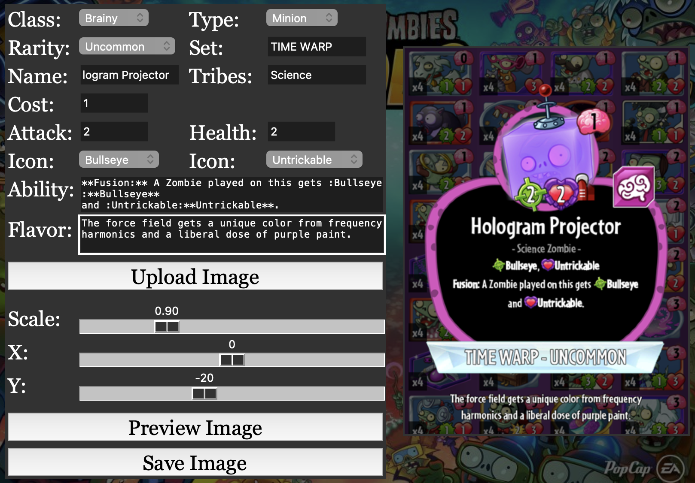

# PvZH Card Image Maker

A Python script for generating images of custom cards, in a format similar to as they would appear in-game. Use the "preview image" button to update the image preview with any changes, and use the "save image" button to save the card image as a file.

This script requires a reasonably up to date Python environment to function properly. I'm not good enough at Python to know exactly what versions are required, but following a reasonably recent tutorial for installing Python and PIL should do the job.

The script has been tested to run as expected on both macOS and Windows, but the UI may look different than in the sample screenshot.

## Requirements

- Python and tkinter (which should be included with Python)
- PIL library, which can be installed in Command Line/Terminal with ```pip install pillow``` (assuming pip is installed).

## Running the Program

Run the app using Command Line/Terminal with ```python image_generator.py``` while in the folder containing ```generator.py```. Make sure the location of image assets is not changed relative to the Python script.

## Usage Tips

- You need to manually choose where to split the card and flavor text into multiple lines, the program can't do that automatically yet.
- Surround text in double asterisks for boldface: ```**Bold**``` produces **Bold**.
- To use game icons, surround the name of the icon in colons: ```:Strikethrough:``` produces .
    - You can add numbers like 4, +2, or -3 after the name of the icon to overlay that number on top of the icon: ```:Strength+3:``` produces the  symbol with +3 written on it.
    - See the Icons folder for a full list of supported icons and their names.

